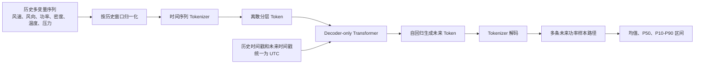

# WindFM 基本实现方法与组内研究方案

> 编写日期：2026-06-12  
> 研究对象：WindFM 开源风电功率预测基础模型  
> 项目场景：京津冀丘陵、山地风电场；超短期预测未来 10 小时，短期预测未来 10 天  
> 文档定位：在《WindFM与开源风电预测模型调研.md》的全景调研基础上，进一步说明 WindFM 的基本实现、苗庄数据适配方式、实验步骤和组内共同学习安排。

---

## 一、这项工作建议怎么做

“把 WindFM 研究一下”不应只停留在介绍论文，也不建议直接从零训练 WindFM。现阶段更合适的目标是：

1. 读懂 WindFM 解决的问题、输入输出和主要模块。
2. 跑通官方预训练模型的零样本预测流程。
3. 把苗庄场站数据转换成官方接口需要的格式。
4. 在未来 10 小时任务上，与 Persistence、LightGBM、XGBoost 等模型做同口径对比。
5. 明确 WindFM 对未来 10 天预测的能力边界，重点验证它是否能使用未来 NWP。
6. 形成一套组内可以讲清楚、可以复现、可以继续扩展的材料。

因此，本轮研究的重点不是“重新训练一个风电基础模型”，而是：

> 先理解并复现公开模型，再判断它对本项目是否真正有用。

建议最后形成四类成果：

- 一份原理说明。
- 一份环境和代码复现记录。
- 一份苗庄数据字段映射表。
- 一份同口径对比实验报告。

---

## 二、WindFM 是什么

WindFM 是一个面向风电功率预测的开源基础模型，论文发表于 arXiv，官方给出的模型规模为 8.1M 参数。

它和常规场站模型的主要区别是：

| 常规场站模型 | WindFM |
|---|---|
| 使用一个场站的数据训练 | 先在大量场站数据上预训练 |
| 换场站通常需要重新训练 | 强调新场站零样本预测 |
| 常输出单条预测曲线 | 可生成多条未来样本路径 |
| 依靠人工设计特征或特定网络 | 通过离散 token 和 Transformer 学习通用时序规律 |

WindFM 使用 NREL WIND Toolkit 进行预训练。论文称预训练数据覆盖超过 126,000 个站点、约 1,500 亿个时间步。

它的主要研究价值不是模型特别大，而是：

> 它把风电功率、风速、风向、温度、压力等连续时间序列转换成类似“词元”的离散表示，再使用生成式 Transformer 预测未来。

---

## 三、WindFM 的基本实现思路

### 1. 总体数据流



### 2. 连续时间序列离散化

传统回归模型直接预测连续功率值。WindFM 先使用专门的时间序列 tokenizer，将连续的多变量观测值编码为分层离散 token。

通俗理解：

> 它先把“这一时刻的风速、风向、功率和气象状态”压缩成模型能够识别的离散符号，再学习这些符号随时间怎样变化。

这样做的目的包括：

- 统一处理多个连续变量。
- 将时间序列预测转化为 token 生成任务。
- 利用生成式模型输出多个可能的未来场景。

### 3. Decoder-only Transformer

WindFM 使用 decoder-only Transformer 自回归生成未来 token。

其逻辑与语言模型相似：

- 语言模型根据前面的词预测下一个词。
- WindFM 根据过去的风电状态 token 预测下一个状态 token。
- 重复生成后，形成完整的未来功率序列。

这种生成方式可以产生多条预测路径，因此天然适合概率预测。

### 4. 概率预测

官方接口通过 `sample_count` 控制生成样本数量。例如生成 100 条未来路径后，可以计算：

- P50：中位数预测，可作为主要点预测。
- P10：较低功率情景。
- P90：较高功率情景。
- P10-P90：80% 预测区间。

这比只输出一条预测曲线多提供了“不确定性”信息，可用于调度风险分析。

---

## 四、官方开源实现的实际输入输出

### 1. 官方输入字段

当前官方示例使用以下固定顺序的六个历史变量：

```text
wind_speed
wind_direction
power
density
temperature
pressure
```

其中 `power` 必须存在。实际适配时应保持官方字段名和顺序，避免模型内部按固定位置取功率变量时发生错位。

官方示例还要求：

- 输入历史时间戳。
- 输入未来时间戳。
- 所有时间戳统一使用 UTC。
- 输入数据不能包含缺失值。
- 历史窗口和预测窗口应保持固定采样间隔。

### 2. 官方接口的基本调用链

下面是根据官方示例整理的最小逻辑，不是本项目最终训练脚本：

```python
from model import WindFM, WindFMTokenizer, WindFMPredictor

tokenizer = WindFMTokenizer.from_pretrained(
    "NeoQuasar/WindFM-Tokenizer"
)
model = WindFM.from_pretrained(
    "NeoQuasar/WindFM"
)

predictor = WindFMPredictor(
    model,
    tokenizer,
    device="cuda:0",
    max_context=1024,
)

pred_samples = predictor.predict(
    df=history_features,
    x_timestamp=history_time_utc,
    y_timestamp=future_time_utc,
    pred_len=forecast_steps,
    sample_count=100,
)
```

首次运行时，模型权重和 tokenizer 会从 Hugging Face 下载。本项目不应在未确认网络、模型文件保存位置和企业数据安全要求前自动执行下载。

### 3. 当前接口没有直接输入未来 NWP

这是本项目最重要的技术边界。

官方示例中：

- `x` 部分传入历史六变量。
- `y` 部分只传入未来时间戳。
- 没有向未来区间传入未来风速、风向、温度、压力等 NWP 数值。

因此，当前官方实现主要根据历史状态自回归生成未来，而不是标准的“未来天气预报驱动功率预测”接口。

这意味着：

- 对未来 10 小时超短期预测，可以作为有价值的零样本对照。
- 对未来 10 天短期预测，单独使用 WindFM 风险较高。
- 10 天任务仍应以未来 NWP 驱动的 LightGBM、XGBoost、TFT 等模型为主。
- 后续可以研究 WindFM 输出与 NWP 模型输出的集成或残差修正。

---

## 五、苗庄数据如何适配

### 1. 当前可用数据

本项目已经具备以下相关数据：

- 全场功率：`风电厂/苗庄风电厂/实发数据/311.csv` 至 `314.csv`。
- 19 台风机实测风速：`data/weather/jk_data/苗庄风电站/25年风速/`。
- 19 台风机实测风向：`data/weather/jk_data/苗庄风电站/25年风向/`。
- 区域气象预报 NetCDF 文件。
- 苗庄场站基础信息和风机信息。

WindFM 第一轮零样本实验优先使用“历史实测功率 + 历史实测气象”，暂不把未来实测气象作为输入。

### 2. 字段映射建议

| WindFM 字段 | 苗庄数据来源 | 处理建议 |
|---|---|---|
| `power` | 311、312、313、314 | 先合成为全场功率，第一轮按 MW 输入，与官方样例保持一致 |
| `wind_speed` | 19 台风机实测风速 | 先做质量控制，再取有效风机均值或中位数 |
| `wind_direction` | 19 台风机实测风向 | 使用 sin/cos 做圆形平均，不能直接算算术平均 |
| `density` | 温度和压力计算，或已有空气密度 | 确认单位后计算；缺少时不能随意填常数后直接报告正式结果 |
| `temperature` | 场站实测或历史气象数据 | 统一单位，重点确认摄氏度或开尔文 |
| `pressure` | 场站实测或历史气象数据 | 统一单位，重点确认 Pa、hPa 或 kPa |
| 时间戳 | 各类文件时间字段 | 先确认本地时区，再由北京时间 UTC+8 转为 UTC |

### 3. 功率处理

沿用当前已验证的业务口径：

```text
power_mw = clip(-(311 + 312 + 313 + 314), 0, 76)
power = power_mw
```

官方预测器会使用历史窗口中每个变量的均值和标准差进行内部标准化，官方样例的功率字段直接采用 MW。因此第一轮适配建议直接输入苗庄全场 MW，不需要预先除以装机容量。按装机容量归一化可作为单独对照实验，但训练输入、真实值和模型输出必须使用同一尺度。

但正式实验前仍需再次确认：

- 四条线路是否完整代表全场功率。
- 负号是否始终表示发电外送。
- 是否存在限电、停机或检修时段。
- 76 MW 是装机容量还是当前可用容量。

WindFM 输出还原到原始输入尺度后，应按物理范围裁剪到 `[0, 76] MW`，再用于业务指标计算。

### 4. 风向处理

风向是周期变量，`1°` 和 `359°` 很接近，不能直接求平均。

对每台风机风向 `θ` 计算：

```text
sin_theta = sin(θ)
cos_theta = cos(θ)
```

再对所有有效风机的 `sin_theta` 和 `cos_theta` 求均值，最后使用 `atan2` 恢复场站平均风向。

### 5. 空气密度处理

如果没有直接的空气密度，可以在确认温度和压力单位后进行近似计算：

```text
density = pressure / (287.05 × temperature_kelvin)
```

该式是干空气近似。若后续能获得湿度，正式模型可使用湿空气密度公式。第一轮实验需要在报告中记录使用的是实测密度、近似计算值还是缺失。

### 6. 时间对齐

WindFM 官方明确要求 UTC。苗庄数据如果记录的是北京时间，需要：

```text
北京时间 2025-01-01 08:00
转换为 UTC 2025-01-01 00:00
```

必须避免只给时间字符串加上 UTC 标记而不减去 8 小时。这会造成整体时间错位。

---

## 六、建议的实验路线

### 阶段 0：静态代码和数据审查

先不运行模型，完成：

- 阅读论文摘要、方法和实验部分。
- 阅读官方 README、示例脚本和预测器代码。
- 确认六个变量的字段顺序和单位。
- 确认模型权重来源及许可证。
- 统计苗庄六个字段的时间范围、采样间隔、缺失率和异常率。

验收结果：

- 一张模型流程图。
- 一张字段映射表。
- 一份依赖和运行条件清单。

### 阶段 1：官方样例复现

目标不是评价苗庄效果，而是确认：

- 模型和 tokenizer 能加载。
- CPU、GPU 推理是否正常。
- 输入长度和输出长度如何设置。
- 输出样本路径的数据结构是什么。
- 运行时间和显存占用是多少。

运行解释器固定为：

```powershell
D:\miniconda\envs\moment\python.exe
```

目前本机检查结果：

| 项目 | 状态 |
|---|---|
| Python 环境 | `moment` 可用 |
| PyTorch | `2.5.1+cu121` |
| CUDA | 可用 |
| GPU | NVIDIA GeForce RTX 3050 Laptop GPU |
| `numpy`、`pandas`、`torch` | 已存在 |
| `huggingface_hub`、`matplotlib`、`tqdm`、`safetensors` | 已存在 |
| `einops` | 已安装 0.8.1 |

经用户确认后，已在 `moment` 环境安装 `einops==0.8.1`。官方样例和苗庄未来10小时小批量回测均已成功运行，详细结果见《WindFM官方样例运行记录.md》和《WindFM苗庄十小时回测汇总.md》。

### 阶段 2：苗庄零样本回测

采用滚动回测方式：

1. 选取一段历史窗口作为模型输入。
2. 预测后续 10 小时，即 15 分钟粒度下的 40 个点。
3. 将预测结果与已发生的实际功率比较。
4. 时间窗口向后滚动，重复多次。

建议历史窗口先比较：

- 24 小时：96 点。
- 60 小时：240 点，对应官方示例的 `lookback=240`。
- 7 天：672 点。

需要确认 `max_context=1024` 下，各变量 token 化后的实际上下文长度是否允许直接使用 672 个时间点，不能只按原始点数推断。

### 阶段 3：10 小时超短期同口径比较

至少比较：

- Persistence：未来功率等于当前功率。
- LightGBM。
- XGBoost。
- NHITS/NBEATSx。
- WindFM P50。

建议按提前量分段评价：

| 分段 | 业务含义 |
|---|---|
| 0-2 小时 | 主要考察当前状态延续能力 |
| 2-5 小时 | 主要考察趋势变化 |
| 5-10 小时 | 更依赖气象变化和模型泛化 |

这样可以判断 WindFM 是在近端还是远端更有价值，而不是只看一个总平均指标。

### 阶段 4：概率预测评价

WindFM 的特点是概率预测，因此不能只评价 P50。

建议增加：

- Pinball Loss：评价不同分位数。
- CRPS：评价整组概率分布。
- P10-P90 区间覆盖率。
- 平均区间宽度。
- 超出区间样本比例。

一个好的区间预测应同时满足：

- 覆盖率合理。
- 区间不能过宽。
- 在大幅爬坡、骤降时能够反映更高不确定性。

### 阶段 5：未来 10 天任务

未来 10 天按 15 分钟粒度为 960 个点，直接自回归生成的误差可能持续累积。

建议把模型分为两条路线：

**路线 A：未来 NWP 驱动主模型**

- EC、盘古或其他气象源。
- 气象本地化订正。
- LightGBM、XGBoost、TFT 等功率映射模型。

**路线 B：WindFM 辅助模型**

- WindFM 生成历史状态延续预测。
- 与 NWP 模型做加权集成。
- 使用校准模型学习 WindFM 和 NWP 模型各自的误差。
- 在 NWP 缺报、延迟或异常时作为备用预测。

现阶段不建议直接修改 WindFM 网络后宣称其已融合未来 NWP。若要真正融合，需要重新设计训练接口，并有足够规模的数据重新训练或微调。

---

## 七、WindFM 和现有模型应如何比较

| 维度 | WindFM | LightGBM/XGBoost | TFT 等多协变量模型 |
|---|---|---|---|
| 是否需要本场站训练 | 零样本可用 | 需要 | 需要 |
| 历史功率利用 | 强 | 依靠滞后特征 | 强 |
| 历史气象利用 | 支持六变量 | 支持任意结构化变量 | 支持 |
| 未来 NWP 利用 | 当前官方示例未直接支持 | 支持 | 支持 |
| 概率预测 | 原生支持样本路径 | 需分位数模型等扩展 | 通常支持 |
| 可解释性 | 较弱 | 较强 | 中等偏弱 |
| 场站快速部署 | 有潜力 | 需重新训练或迁移 | 通常需训练 |
| 10 小时任务 | 值得重点验证 | 主基线 | 主对比 |
| 10 天任务 | 适合作为辅助或对照 | 主模型候选 | 主模型候选 |

评价时必须做到：

- 使用完全相同的测试时段。
- 使用相同的实际功率标签。
- 使用相同的异常、限电和停机剔除规则。
- 使用相同的装机容量归一化方法。
- 分别报告整体指标和分提前量指标。

---

## 八、建议的组内分工

### 1. 原理与论文组

负责：

- 说明 tokenizer、Transformer、自回归生成和概率预测。
- 整理论文训练数据、实验数据和零样本含义。
- 画出一张能够用于组内讲解的流程图。

### 2. 开源代码与环境组

负责：

- 阅读 `model/`、`examples/` 和 `requirements.txt`。
- 记录模型加载、推理、输入检查和输出处理过程。
- 复现官方样例。
- 记录运行时间、显存和依赖版本。

### 3. 数据适配组

负责：

- 生成苗庄六变量时间序列表。
- 处理全场功率、19 台风机风速和圆形平均风向。
- 确认温度、压力、密度单位。
- 处理 UTC 转换、缺失和异常值。

### 4. 实验评价组

负责：

- 设计滚动回测。
- 统一 WindFM、Persistence、LightGBM、XGBoost 的评价口径。
- 输出确定性和概率预测指标。
- 分析爬坡、骤降、低风速和高风速场景。

### 5. 未来气象融合组

负责：

- 核查 WindFM 是否有扩展 future covariates 的可行接口。
- 设计 WindFM 与多源 NWP 模型的集成方法。
- 跟踪新的风电基础模型，例如 2026 年 6 月发布论文的 Tyan-WP。

---

## 九、一周研究安排

| 时间 | 工作 | 产出 |
|---|---|---|
| 第 1 天 | 阅读论文、README 和示例 | 原理摘要、术语表 |
| 第 2 天 | 阅读 tokenizer、模型和 predictor 代码 | 模块调用图、输入输出表 |
| 第 3 天 | 核查环境和依赖，复现官方样例 | 运行记录、依赖清单 |
| 第 4 天 | 整理苗庄六变量数据 | 数据适配表、质量报告 |
| 第 5 天 | 完成 10 小时滚动回测 | WindFM 预测文件和图 |
| 第 6 天 | 与现有模型同口径比较 | 指标表、分提前量分析 |
| 第 7 天 | 组内交流 | 讲解材料、问题清单、下一步建议 |

如果依赖或模型权重暂时无法获取，前两天的代码阅读、数据映射和评价设计仍可独立完成，不需要等待环境问题解决。

---

## 十、组内交流时应讲清楚的六个问题

1. WindFM 为什么称为基础模型，而不是普通场站模型？
2. 连续气象和功率数据为什么要转换为 token？
3. 零样本预测具体表示什么，是否等于“不需要本地数据”？
4. 多条预测样本路径如何转为 P50 和预测区间？
5. WindFM 为什么更适合先验证未来 10 小时，而不是直接承担未来 10 天？
6. WindFM 与未来 NWP 驱动模型如何形成互补？

其中第三个问题尤其需要说明：

> 零样本表示不使用目标场站数据重新训练模型，不表示预测时不需要该场站的历史输入序列，也不表示模型一定比本地训练模型准确。

---

## 十一、主要风险和研究边界

### 1. 数据域差异

WindFM 主要使用美国 WIND Toolkit 预训练。苗庄处于京津冀，地形、气候、机型和调度规则均可能不同。

因此论文中的跨区域泛化结论不能直接替代苗庄实测验证。

### 2. 未来 NWP 缺口

当前官方示例没有直接传入未来 NWP。对未来 10 天任务，这是最明显的能力缺口。

### 3. 数据字段和单位

六个字段的顺序、量纲、功率归一化和 UTC 时间如果处理错误，模型仍可能输出结果，但结果没有业务意义。

### 4. 异常运行状态

限电、停机、检修、通信中断造成的功率变化不是单纯气象规律。模型训练和评价必须有状态标记，否则会把运行异常误认为气象响应。

### 5. 长提前量误差累积

自回归模型每一步依赖前一步生成结果。预测步数越长，误差和不确定性越可能累积。

### 6. 开源成熟度

截至 2026-06-12，官方仓库代码规模较小，发布版本和工程化文档有限。研究中要保留：

- 仓库 commit 或下载日期。
- 依赖版本。
- 模型权重版本。
- 本地适配代码。
- 可重复的输入样例和输出结果。

---

## 十二、值得继续关注的 Tyan-WP

2026 年 6 月 7 日，arXiv 发布了 Tyan-WP 论文。它同样是风电功率基础模型，强调超短期概率预测，并在 WindFM 类思路上进一步加入：

- 静态场站嵌入：坐标、地形和生态区域等信息。
- Power-Aware Meteorological Fusion：显式建模历史功率与气象协变量之间的关系。

这两个方向对京津冀丘陵、山地场站具有较强研究价值，因为：

- WindFM 对场站静态地形信息利用有限。
- 山地风电场的空间和地形差异不能只靠功率历史描述。
- 功率与气象的融合模块比单纯历史自回归更贴近业务问题。

但目前应把 Tyan-WP 定位为“最新论文跟踪项”。在没有确认官方代码和模型权重可用前，不能把论文结果当作已经可以直接落地的开源方案。

---

## 十三、建议的最终结论

WindFM 值得研究，原因是它代表了风电功率预测从“单场站独立训练”向“风电领域预训练和跨场站迁移”发展的方向。它的实现核心是将历史多变量连续时间序列离散化为分层 token，再由 decoder-only Transformer 自回归生成未来序列，并通过多次采样输出概率预测。

对本项目而言，WindFM 最适合先承担未来 10 小时超短期预测的零样本对照和概率预测实验。当前官方实现只接收历史多变量和未来时间戳，没有在预测区间直接输入未来 NWP，因此不能单独作为未来 10 天短期预测的主模型。未来 10 天任务仍应以多源 NWP 驱动模型为主，并研究 WindFM 在模型集成、残差订正、缺报备用和概率区间方面的辅助价值。

本轮组内研究的成功标准不是 WindFM 一定取得最高准确率，而是能够回答：

1. 官方模型能否复现。
2. 苗庄数据能否正确适配。
3. WindFM 在不同提前量上是否优于简单基线。
4. 其概率区间是否可靠。
5. 它与未来 NWP 模型怎样互补。

---

## 十四、资料来源

- WindFM 论文：<https://arxiv.org/abs/2509.06311>
- WindFM 官方 GitHub：<https://github.com/shiyu-coder/WindFM>
- WindFM 官方依赖：<https://github.com/shiyu-coder/WindFM/blob/master/requirements.txt>
- WindFM 当前官方代码使用的模型：<https://huggingface.co/NeoQuasar/WindFM>
- WindFM 当前官方代码使用的 tokenizer：<https://huggingface.co/NeoQuasar/WindFM-Tokenizer>
- NREL WIND Toolkit：<https://www.nrel.gov/grid/wind-toolkit>
- Tyan-WP 论文：<https://arxiv.org/abs/2606.08630>
